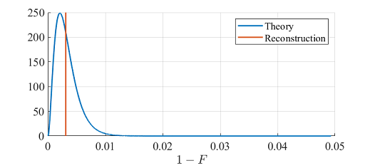

# Root approach tomography

MATLAB library for the quantum state and quantum process tomography using root approach. The library contains tools for quantum state and quantum process reconstruction by the measurement result, estimation of statistical adequacy and theoretical fidelity statistical distribution.

## Getting Started

### Prerequisites and installing

Required toolboxes:
* Statistics toolbox

To install the library clone the repository or download and unpack zip-archive. Before using run the startup script.

```
>> rt_startup
```

### Data format

Quantum tomography of a state $\rho$ consists of a set of complementary _experiments_. In each experiment one perform a measurement that has several outcomes described by a set of measurement operators $M_k$ such that the probability to  get _k_-th result is ${p_k=\text{Tr}(\rho M_k)}$. The measurement _protocol_ describes the set of experiments and corresponding measurement operators matrices. Each experiment is repeated many times resulting in some number of outcomes for each measurement operator.
```
proto{j}(:,:,k) % k-th measurement matrix for j-th experiment
clicks{j}(k,1) % number of k-th outcome observations in j-th experiment
nshots(1,j) % number of j-th experiment runs
```

### Quantum state tomography
Reconstruct density matrix and estimate fidelity comparing to expected state.
```
dm_expected = [0.5, 0.45; 0.45, 0.5];
dm = rt_dm_reconstruct(clicks,proto,nshots,'Display',true);
fprintf('Fidelity: %.6f\n', rt_fidelity(dm, dm_expected));
```
Output:
```
=== Automatic rank estimation ===
Try rank 1
Iteration 311 		 Difference 9.8078e-09
Try rank 2
Iteration 38 		 Difference 8.4052e-09
Rank 2 is statistically significant at significance level 0.005. Procedure terminated.
Fidelity: 0.999641
```
If you don't specify nshots then number of _j_-th experiment runs is taken as the sum over all counts.
```
rt_dm_reconstruct(clicks,proto) % nshots(1,j) = sum(clicks{j})
```
Instead of automatic rank estimation you can pick a specific rank of a quantum state model. For example, in your experiment it could be likely to have a pure (rank 1).
```
dm_expected = [1, 1j; -1j, 1]/2;
dm = rt_dm_reconstruct(clicks,proto,nshots,'Display',true,'Rank',1);
fprintf('Fidelity: %4f\n', rt_fidelity(dm, dm_expected));
```
Output:
```
Iteration 20 		 Difference 8.5074e-09
Fidelity: 0.998998
```
In general, one can specify any rank from 1 to a Hilbert space dimension.

### Fidelity distribution

One can theoretically estimate reconstruction fidelity for the desired measurement and quantum state model. This code will return vector of variances of the quantum state independent parameters.
```
d = rt_dm_theory(dm_expected,proto,nshots)
```
The distribution of infidelity has the form of a generalized chi-squared distribution: ${1-F \sim \sum_j{d_j \xi_j^2}}$, where each $\xi_j$ is a normal distribution with zero mean and unit variance. The following script plots theoretical distribution and shows the value of infidelity for a single tomography experiment.

```
dm_expected = [0.5, 0.45; 0.45, 0.5];
dm = rt_dm_reconstruct(clicks,proto,nshots); % Reconstruct state
F = rt_fidelity(dm, dm_expected); % Estimate fidelity with expected state
d = rt_dm_theory(dm_expected,proto,nshots); % Find theoretical distribution parameters
[p,dF] = rt_chi2pdf_general([],d); % Get distribution
figure; hold on; grid on;
plot(dF,p,'LineWidth',1.5,'DisplayName','Theory');
plot([1-F,1-F],ylim,'LineWidth',1.5,'DisplayName','Reconstruction');
xlabel('$$1-F$$','Interpreter','latex');
legend('show');
```


The theoretical infidelity mean and variance could be obtained from the variance vector.
```
sum(d) % Mean infidelity
2*sum(d.^2) % Infidelity variance
1-sum(d) % Mean fidelity
```